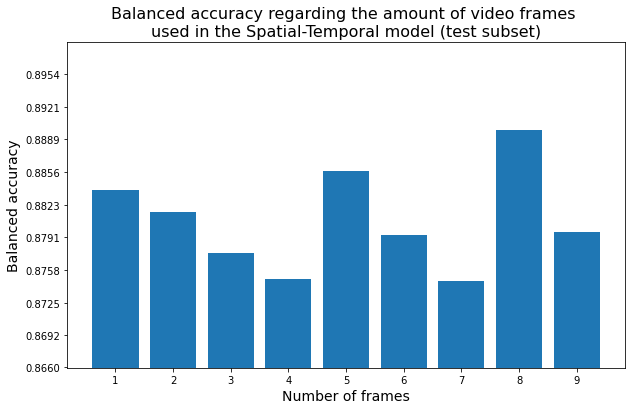
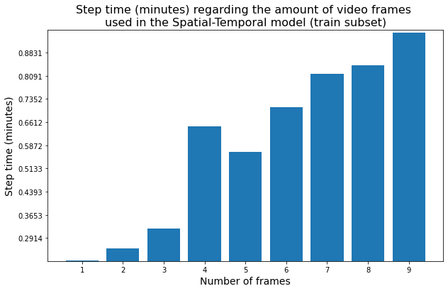
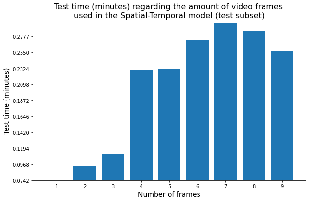
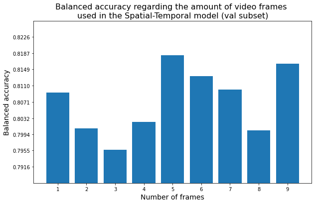

# Pedestrian Crossing Intention
Prediction of the intention of pedestrians to cross the street or not, using Graph Neural Networks and the coordinates of their skeleton. We made our own dataset of crossing and not-crossing scenarios using CARLA simulator.

# Spatial-Temporal Graph Convolutional Network

I initially designed a first spatial model using the GCNConv graph convolutional operator, with an input size equal to 3, which are the 3 features of each node (the 3 coordinate axes of each joint). However, the results only improved a bit, and training it more produced a high overfitting.

To get good results I had to design a Spatial-Temporal model. What I did was, for a set of *n* frames with their *n* skeletons, predict if in a future frame the pedestrian will perform the action of crossing or not. That is, from the movements and trajectory of the pedestrian during *n* frames (grouped using a sliding window), predict whether he or she will cross the street or not in the near future.

The layers of the model are detailed in the following table:

|     Layer                     |     Input shape    |     Output shape    |
|:------------------------------|:-------------------|:--------------------|
|     Recurrent part:           |     -              |     -               |
|      \|--> GConvGRU           |     [-1, 26, 3]    |     [-1, 26, 3]     |
|      \|--> Dropout   (0.3)    |     [-1, 26, 3]    |     [-1, 26, 3]     |
|      \|--> ReLU               |     [-1, 26, 3]    |     [-1, 26, 3]     |
|     End of recurrent part     |     -              |     -               |
|     Reshape                   |     [-1, 26, 3]    |     [-1, 78]        |
|     Linear                    |     [-1, 78]       |     [-1, 39]        |
|     Dropout (0.3)             |     [-1, 39]       |     [-1, 39]        |
|     ReLU                      |     [-1, 39]       |     [-1, 39]        |
|     Linear                    |     [-1, 39]       |     [-1, 19]        |
|     Dropout (0.3)             |     [-1, 19]       |     [-1, 19]        |
|     ReLU                      |     [-1, 19]       |     [-1, 19]        |
|     Linear                    |     [-1, 19]       |     [-1, 2]         |
|     Softmax                   |     [-1, 2]        |     [-1, 2]         |

The input to the network contains, for each frame, 26*3 elements because in CARLA there are 26 different joints, and we input the 3D coordinates of them.

When the network uses 8 frames to define this temporal dimension of the Spatial-Temporal GCN, the balanced accuracy of the test subset is the highest (0.8898).

However, using 8 frames requires 0.8425 minutes per epoch for training and when using 5 frames, only 0.5652 minutes per epoch:

Similarly, test time increases from 0.2322 minutes with the model of 5 frames to 0.2852 for the model of 8 frames. 

It is also interesting to see that with the validation subset (never used to train), the model with 5 frames performs better:

For these reasons, to generate the final results of the following section, I have chosen the Spatial-Temporal model that uses 5 frames to define its temporal dimension.

However, you can find all the models exported [here](exportedModels/).

# Results

Final results when classifying our CARLA dataset of pedestrian skeletons using the Spatial-Temporal Graph Convolutional Network that uses 5 frames to define the temporal dimension. 

## Metrics

|            Metric |  train |    val |   test |
|:------------------|:------:|:------:|:-------|
|          Accuracy | 0.9171 | 0.8194 | 0.8834 |
| Balanced accuracy | 0.9177 | 0.8183 | 0.8857 |
|         Precision | 0.9334 | 0.8103 | 0.9207 |
|            Recall | 0.9078 | 0.8014 | 0.8638 |
|          f1-score | 0.9204 | 0.8058 | 0.8913 |

## Videos

### Train videos

### Test videos

